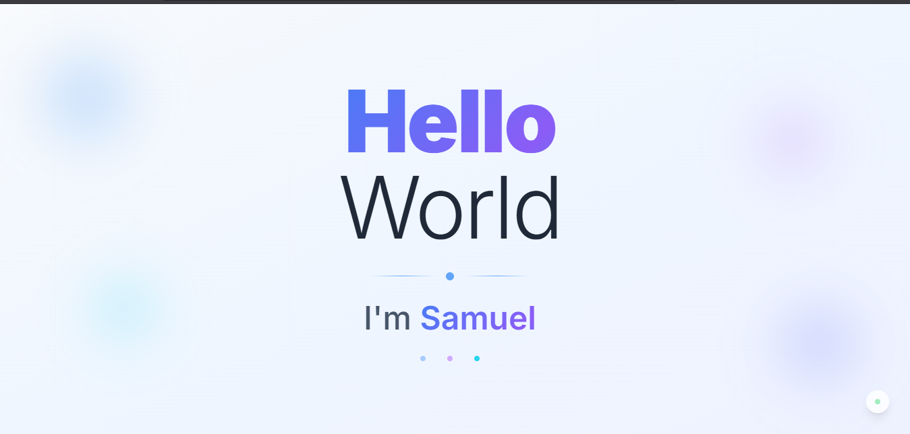

# Trabalho Prático - Semana-01

## Informações Gerais

Nome: Samuel Oliveira Matos
Matricula: 789836

## Tela de inspeção com navegador

`<Coloque aqui o print da tela de inspeção do seu navegador>`
### instagram web:
%2017.42.01_6cd9f5f8.jpg)

## Tela de projeto no Replit

`<Coloque aqui o print da tela do projeto no Replit>`


## Adaptei o codigo da pagina pra rodar localmente sem dependencias especificas 
no PowerShell:
```PHP
    cd "HelloSamuel"
    npm install
    npm run dev
```


## Orientações sobre Linguagem MarkDown

Acesse e leia o [tutorial do GitHub com a sintaxe básica para escrita de texto em Markdown](https://docs.github.com/pt/get-started/writing-on-github/getting-started-with-writing-and-formatting-on-github/basic-writing-and-formatting-syntax).

Veja aqui o exemplo de como colocar uma imagem nos locais acima. 


